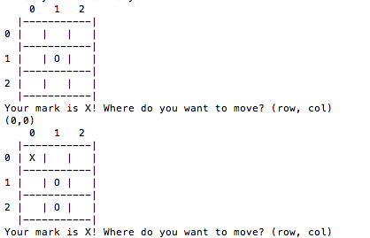

# tic-tac-toe
- Game of tic-tac-toe played in the console where the computer never loses and wins whenever possible.

## Local Setup
- Clone this repo and navigate into the project directory
- From the main directory, navigate into the lib folder and run the command ```ruby game.rb```
